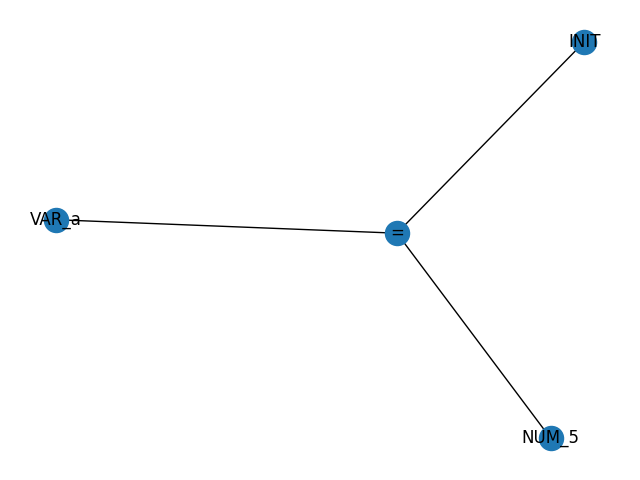
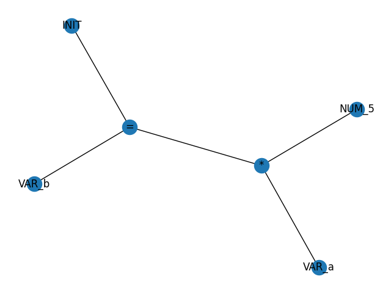
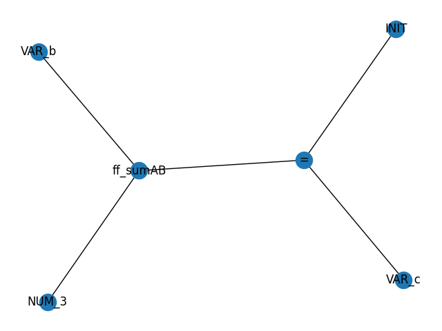

# Aceptar archivos y ejecutar el contenido

## Descripción de las Funciones Implementadas como Herramientas y Accesorios a la Gramática

No se implementó ninguna función como accesorio a la gramática para esta nueva característica. Se usaron las siguientes funciones nativas de Python que no se habían utilizado en otras partes del código:

- `open()`: Abre el archivo.
- `<string>.strip()`: Elimina espacios y caracteres de nueva línea del principio y el final de un string.

## Uso

Carga el archivo pasado como argumento de ejecución en modo de lectura.

- `open(sys.argv[1], 'r')`

Se eliminan los espacios y caracteres de nueva línea por cada línea del archivo.

- `line = line.strip()`

## Implementación

### translator.py

```python
if len(sys.argv) > 1:
    with open(sys.argv[1], 'r') as file:
        for line in file:
            line = line.strip()
            if line:
                parseGraph = nx.Graph()
                NODE_COUNTER = 0

                root = add_node({"type":"INITIAL", "label":"INIT"})

                # Obtener el resultado del parsing de data
                result = parser.parse(line)

                parseGraph.add_edge(root["counter"], result["counter"])

                labels = nx.get_node_attributes(parseGraph, "label")
                
                # Visualizacion del arbol de ejecucion
                nx.draw(parseGraph, labels=labels, with_labels=True)
                plt.show()

                result = execute_parse_tree(parseGraph)
                print("Result", result)
```

## Llamadas a Funciones

El módulo en sí se llamó con el archivo “test.txt” con el siguiente contenido:

```markdown
a=5
b=a*5
c=b->sumAB(3)
```

Llamándolo con el siguiente comando:

```powershell
python translator.py test.txt
```

Grafos resultantes:







Resultado:

```markdown
Graph with 0 nodes and 0 edges
Graph with 1 nodes and 0 edges
Graph with 2 nodes and 0 edges
Graph with 3 nodes and 0 edges
Result 5
Graph with 0 nodes and 0 edges
Graph with 1 nodes and 0 edges
Graph with 2 nodes and 0 edges
Graph with 3 nodes and 0 edges
Graph with 4 nodes and 2 edges
Graph with 5 nodes and 2 edges
Result 25
Graph with 0 nodes and 0 edges
Graph with 1 nodes and 0 edges
Graph with 2 nodes and 0 edges
Graph with 3 nodes and 0 edges
Graph with 4 nodes and 2 edges
Graph with 5 nodes and 2 edges
Result 28
```

## Asignación de Variables

El módulo en sí se llamó con el archivo “test.txt” con el siguiente contenido:

```markdown
a=5
b=a*5
c=b->sumAB(3)
```

Llamándolo con el siguiente comando:

```powershell
python translator.py test.txt
```

Grafos resultantes:


Resultado:

```markdown
Graph with 0 nodes and 0 edges
Graph with 1 nodes and 0 edges
Graph with 2 nodes and 0 edges
Graph with 3 nodes and 0 edges
Result 5
Graph with 0 nodes and 0 edges
Graph with 1 nodes and 0 edges
Graph with 2 nodes and 0 edges
Graph with 3 nodes and 0 edges
Graph with 4 nodes and 2 edges
Graph with 5 nodes and 2 edges
Result 25
Graph with 0 nodes and 0 edges
Graph with 1 nodes and 0 edges
Graph with 2 nodes and 0 edges
Graph with 3 nodes and 0 edges
Graph with 4 nodes and 2 edges
Graph with 5 nodes and 2 edges
Result 28
```

## Ejemplo de Uso

El módulo en sí se llama desde la línea de comandos al momento de ejecutar el translator.py como un parámetro adicional. Simplemente se agrega la ruta al archivo:

```powershell
python translator.py test.txt
```

El archivo debe contener instrucciones separadas en líneas diferentes, como en el archivo “test.txt”:

```markdown
a=5
b=a*5
c=b->sumAB(3)
```
