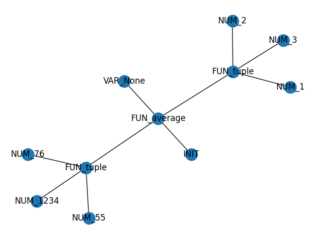
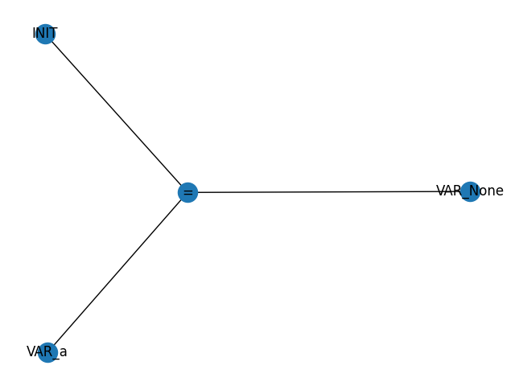

# Aceptar None como valor de la gramática para inicialización de variables

## Implementación

En `translator.py` solo se agregó `None` a la tabla de símbolos:

#### translator.py

```python
symbol_table["None"] = None
```

## Llamadas a Funciones

Se puede utilizar `None` como parámetro en una llamada a función:

```markdown
average(tuple(1234,55,76),None,tuple(1,2,3))
```

Grafo resultante:



Resultado:

```markdown
Graph with 0 nodes and 0 edges
Graph with 1 nodes and 0 edges
Graph with 2 nodes and 0 edges
Graph with 3 nodes and 0 edges
Graph with 4 nodes and 0 edges
Graph with 5 nodes and 3 edges
Graph with 6 nodes and 3 edges
Graph with 7 nodes and 3 edges
Graph with 8 nodes and 3 edges
Graph with 9 nodes and 3 edges
Graph with 10 nodes and 6 edges
Result 262.0
```

## Asignación de Variables

También se pueden asignar variables como `None`:

```markdown
a=None
```

Grafo resultante:



Resultado:

```markdown
Graph with 0 nodes and 0 edges
Graph with 1 nodes and 0 edges
Graph with 2 nodes and 0 edges
Graph with 3 nodes and 0 edges
Result None
```

## Ejemplo de Uso

Solo se tiene que utilizar `None` como cualquier otro valor de variable:

```markdown
a=None
```

Grafo resultante:


Resultado:

```markdown
Graph with 0 nodes and 0 edges
Graph with 1 nodes and 0 edges
Graph with 2 nodes and 0 edges
Graph with 3 nodes and 0 edges
Result None
```