# Aceptar cualquier función de numpy para manejo de matrices

## Descripción de las Funciones Implementadas como Herramientas y Accesorios a la Gramática

Se implementó la siguiente función:

- `search_np(function_name)`: Busca la función de numpy con el nombre `function_name`  y la regresa. Sus parámetros son:
    - `function_name` : Nombre de la función de numpy a buscar.

## Implementación

En `library.py` solo se implementó la función `seach_np`:

#### library.py

```python
def search_np(function_name):
    try:
        return getattr(np, function_name)
    except:
        pass
    return None
```

En la función `visit_node` de `translator.py` se agregó una condicional que ejecuta `search_np` si se realiza una llamada a función y la función no se encuentra en la tabla de símbolos ni es una función de cv2.

#### translator.py

```python
def visit_node(tree, node_id, from_id):
    children = tree.neighbors(node_id)
    res = []
    for c in children:
        if(c != from_id):
            res.append(visit_node(tree, c, node_id))
            # print(res[-1])
    current_node = tree.nodes[node_id]

    if(current_node["type"] == "INITIAL"):
        return res[0]
    
    if(current_node["type"] == "ASSIGN"):
        symbol_table[res[0]] = res[1]
        # print(symbol_table)
        return res[1]
    
    if(current_node["type"] == "NUMBER"):
        return current_node["value"]
    
    if(current_node["type"] == "STRING"):
        return current_node["value"]
    
    if(current_node["type"] == "PENDING_NODE"):
        return res[0]
    
    if(current_node["type"] == "VARIABLE_ASSIGN"):
        return current_node["value"]
    
    if(current_node["type"] == "VARIABLE"):
        if current_node["value"] in symbol_table:
            return symbol_table[current_node["value"]]
        print("ERROR! Variable not found, returning 0")
        return 0
    
    if(current_node["type"] == "FUNCTION_CALL" or current_node["type"] == "FLOW_FUNCTION_CALL"):
        if current_node["value"] in symbol_table:
            if (len(res) > 0):
                return symbol_table[current_node["value"]](*res)
            else:
                return symbol_table[current_node["value"]]()
        else:
            fn = search_cv2(current_node["value"])
            if fn is not None:
                return fn(*res)
            else:
                fn = search_np(current_node["value"])
                if fn is not None:
                    return fn(*res)
        print("ERROR! Function not found, returning 0")
        return 0
    
```

## Llamadas a Funciones

Como la función `np_search` cubre la implementación de todas las funciones de numpy, se demostrará su uso con 9 funciones de numpy diferentes:

#### np_mean

```markdown
mean(tuple(1234,55,76))
```

Grafo resultante:

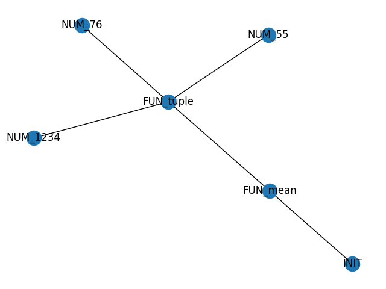

Resultado:

```markdown
Graph with 0 nodes and 0 edges
Graph with 1 nodes and 0 edges
Graph with 2 nodes and 0 edges
Graph with 3 nodes and 0 edges
Graph with 4 nodes and 0 edges
Graph with 5 nodes and 3 edges
Result (455.0, 0.0, 0.0, 0.0)
```

#### np_average

```markdown
average(tuple(1234,55,76),None,tuple(1,2,3))
```

Grafo resultante:

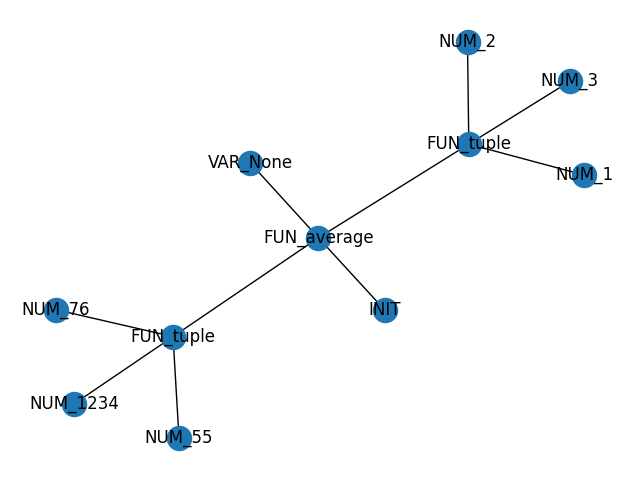

Resultado:

```markdown
Graph with 0 nodes and 0 edges
Graph with 1 nodes and 0 edges
Graph with 2 nodes and 0 edges
Graph with 3 nodes and 0 edges
Graph with 4 nodes and 0 edges
Graph with 5 nodes and 3 edges
Graph with 6 nodes and 3 edges
Graph with 7 nodes and 3 edges
Graph with 8 nodes and 3 edges
Graph with 9 nodes and 3 edges
Graph with 10 nodes and 6 edges
Result 262.0
```

#### np_median

```markdown
median(tuple(1234,55,76))
```

Grafo resultante:

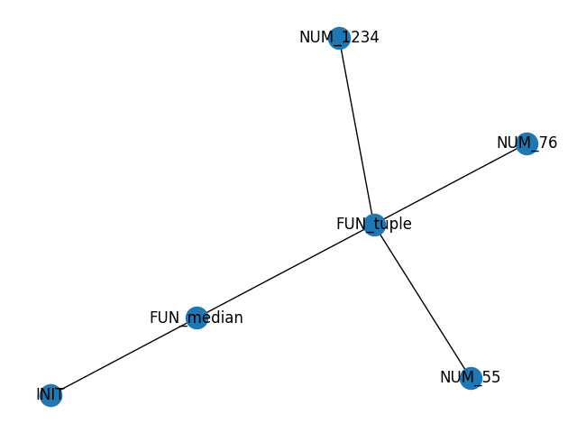

Resultado:

```markdown
Graph with 0 nodes and 0 edges
Graph with 1 nodes and 0 edges
Graph with 2 nodes and 0 edges
Graph with 3 nodes and 0 edges
Graph with 4 nodes and 0 edges
Graph with 5 nodes and 3 edges
Result 76.0
```

#### np_std

```markdown
std(tuple(123,346,987,3,55))
```

Grafo resultante:

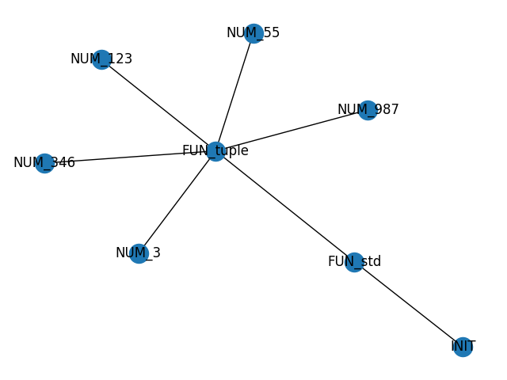

Resultado:

```markdown
Graph with 0 nodes and 0 edges
Graph with 1 nodes and 0 edges
Graph with 2 nodes and 0 edges
Graph with 3 nodes and 0 edges
Graph with 4 nodes and 0 edges
Graph with 5 nodes and 0 edges
Graph with 6 nodes and 0 edges
Graph with 7 nodes and 5 edges
Result 361.5546431730618
```

#### np_histogram

```markdown
histogram(tuple(1,2,1),tuple(0,1,2,3))
```

Grafo resultante:

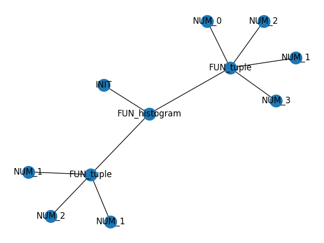

Resultado:

```markdown
Graph with 0 nodes and 0 edges
Graph with 1 nodes and 0 edges
Graph with 2 nodes and 0 edges
Graph with 3 nodes and 0 edges
Graph with 4 nodes and 0 edges
Graph with 5 nodes and 3 edges
Graph with 6 nodes and 3 edges
Graph with 7 nodes and 3 edges
Graph with 8 nodes and 3 edges
Graph with 9 nodes and 3 edges
Graph with 10 nodes and 7 edges
Result (array([0, 2, 1], dtype=int64), array([0, 1, 2, 3]))
```

#### np_shape

```markdown
shape(tuple(tuple(1,43,7),tuple(1,2,3)))
```

Grafo resultante:

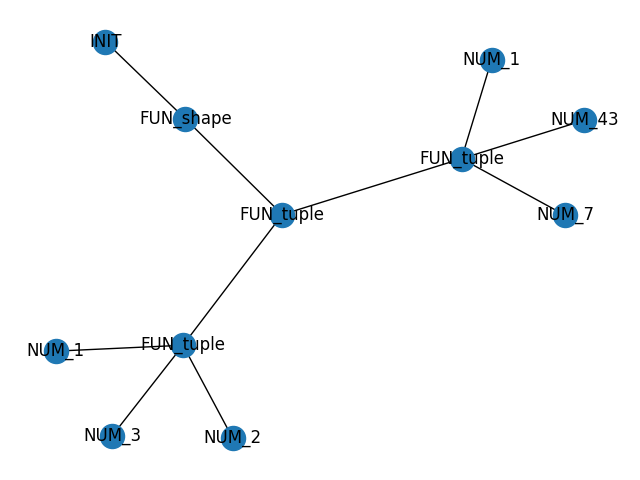

Resultado:

```markdown
Graph with 0 nodes and 0 edges
Graph with 1 nodes and 0 edges
Graph with 2 nodes and 0 edges
Graph with 3 nodes and 0 edges
Graph with 4 nodes and 0 edges
Graph with 5 nodes and 3 edges
Graph with 6 nodes and 3 edges
Graph with 7 nodes and 3 edges
Graph with 8 nodes and 3 edges
Graph with 9 nodes and 6 edges
Graph with 10 nodes and 8 edges
Result (2, 3)
```

#### np_corrcoef

```markdown
corrcoef(tuple(tuple(0.77395605,0.43887844,0.85859792),tuple(0.69736803,0.09417735,0.97562235),tuple(0.7611397,0.78606431,0.12811363)))
```

Grafo resultante:

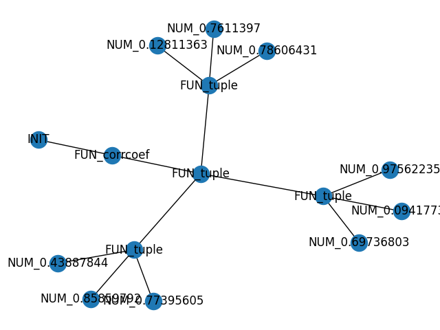

Resultado:

```markdown
Graph with 0 nodes and 0 edges
Graph with 1 nodes and 0 edges
Graph with 2 nodes and 0 edges
Graph with 3 nodes and 0 edges
Graph with 4 nodes and 0 edges
Graph with 5 nodes and 3 edges
Graph with 6 nodes and 3 edges
Graph with 7 nodes and 3 edges
Graph with 8 nodes and 3 edges
Graph with 9 nodes and 6 edges
Graph with 10 nodes and 6 edges
Graph with 11 nodes and 6 edges
Graph with 12 nodes and 6 edges
Graph with 13 nodes and 9 edges
Graph with 14 nodes and 12 edges
Result [[ 1.          0.99256089 -0.68080987]
 [ 0.99256089  1.         -0.76492173]
 [-0.68080987 -0.76492173  1.        ]]
```

#### np_correlate

```markdown
correlate(tuple(1,2,3),tuple(0,1,0.5))
```

Grafo resultante:

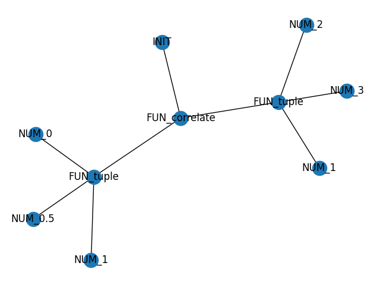

Resultado:

```markdown
Graph with 0 nodes and 0 edges
Graph with 1 nodes and 0 edges
Graph with 2 nodes and 0 edges
Graph with 3 nodes and 0 edges
Graph with 4 nodes and 0 edges
Graph with 5 nodes and 3 edges
Graph with 6 nodes and 3 edges
Graph with 7 nodes and 3 edges
Graph with 8 nodes and 3 edges
Graph with 9 nodes and 6 edges
Result [3.5]
```

#### np_dot

```markdown
dot(tuple(tuple(1,0),tuple(0,1)),tuple(tuple(4,1),tuple(2,2)))
```

Grafo resultante:

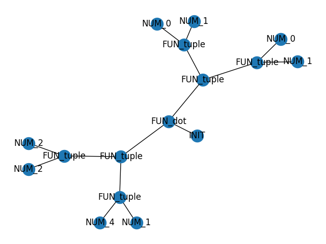

Resultado:

```markdown
Graph with 0 nodes and 0 edges
Graph with 1 nodes and 0 edges
Graph with 2 nodes and 0 edges
Graph with 3 nodes and 0 edges
Graph with 4 nodes and 2 edges
Graph with 5 nodes and 2 edges
Graph with 6 nodes and 2 edges
Graph with 7 nodes and 4 edges
Graph with 8 nodes and 6 edges
Graph with 9 nodes and 6 edges
Graph with 10 nodes and 6 edges
Graph with 11 nodes and 8 edges
Graph with 12 nodes and 8 edges
Graph with 13 nodes and 8 edges
Graph with 14 nodes and 10 edges
Graph with 15 nodes and 12 edges
Result [[4 1]
 [2 2]]
```

## Asignación de Variables

También se pueden asignar variables a los resultados de las funciones de numpy:

```markdown
a=average(tuple(34,57,8))
c=a->sumAB(4)
```

Grafos resultantes:

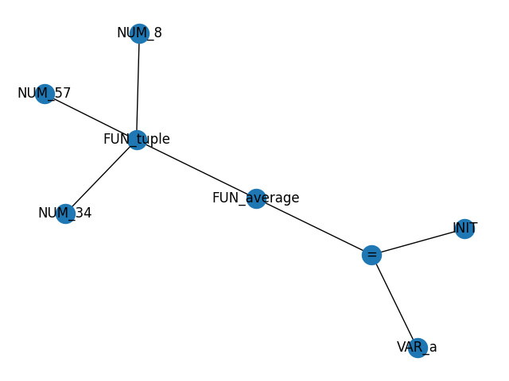

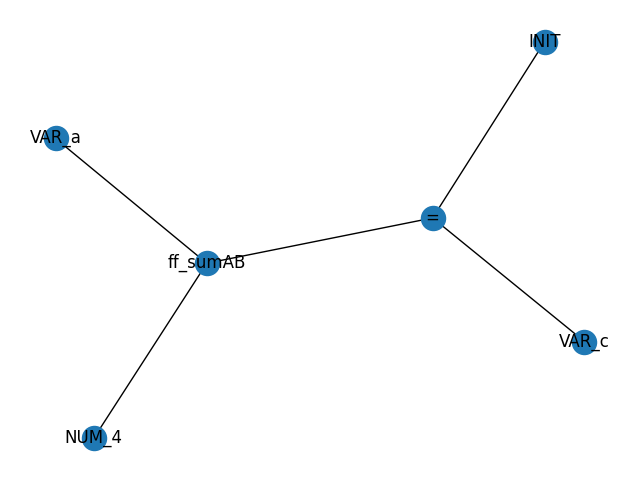

Resultado:

```markdown
>a=average(tuple(34,57,8))
Graph with 0 nodes and 0 edges
Graph with 1 nodes and 0 edges
Graph with 2 nodes and 0 edges
Graph with 3 nodes and 0 edges
Graph with 4 nodes and 0 edges
Graph with 5 nodes and 3 edges
Graph with 6 nodes and 4 edges
Graph with 7 nodes and 4 edges
Result 33.0
>c=a->sumAB(4)            
Graph with 0 nodes and 0 edges
Graph with 1 nodes and 0 edges
Graph with 2 nodes and 0 edges
Graph with 3 nodes and 0 edges
Graph with 4 nodes and 2 edges
Graph with 5 nodes and 2 edges
Result 37.0
```

## Ejemplo de Uso

Solo se tiene que llamar una función de numpy con su nombre para utilizar el módulo:

```powershell
a=average(tuple(34,57,8))
c=a->sumAB(4)
```

Grafos resultantes:


Resultado:

```markdown
>a=average(tuple(34,57,8))
Graph with 0 nodes and 0 edges
Graph with 1 nodes and 0 edges
Graph with 2 nodes and 0 edges
Graph with 3 nodes and 0 edges
Graph with 4 nodes and 0 edges
Graph with 5 nodes and 3 edges
Graph with 6 nodes and 4 edges
Graph with 7 nodes and 4 edges
Result 33.0
>c=a->sumAB(4)            
Graph with 0 nodes and 0 edges
Graph with 1 nodes and 0 edges
Graph with 2 nodes and 0 edges
Graph with 3 nodes and 0 edges
Graph with 4 nodes and 2 edges
Graph with 5 nodes and 2 edges
Result 37.0
```