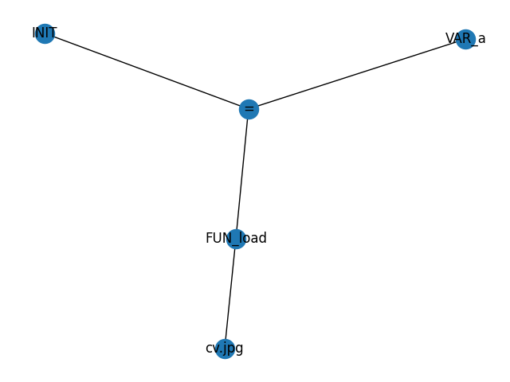
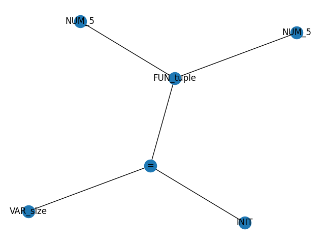
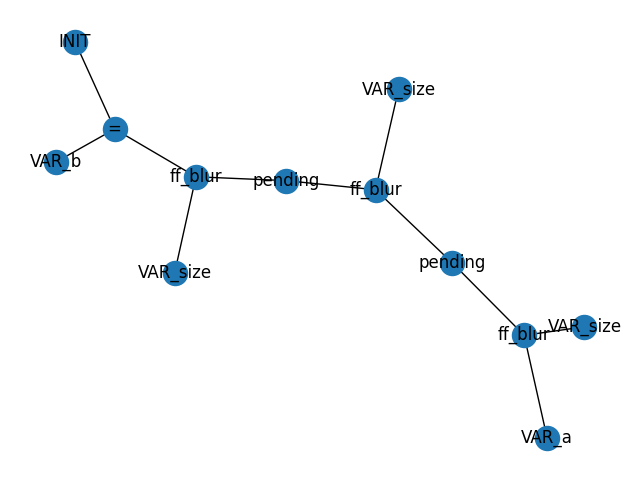
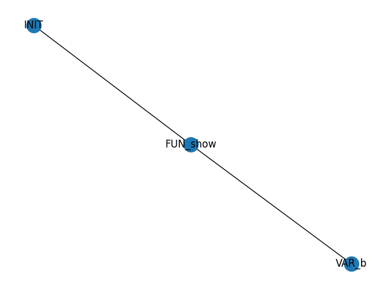
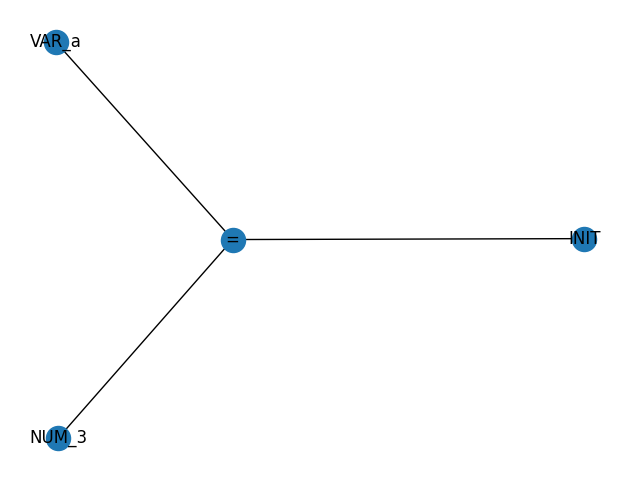
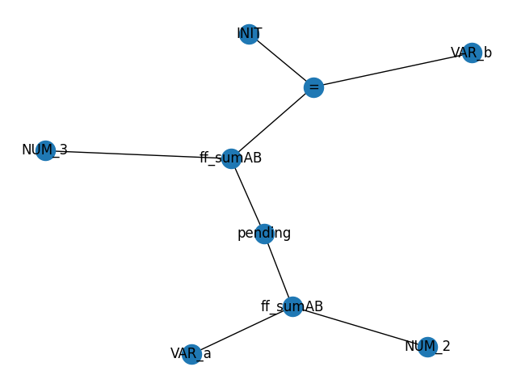

# Implementar flujos de funciones que solo reciban la imagen como parámetro

## Descripción de las Funciones Implementadas como Herramientas y Accesorios a la Gramática

Se implementaron las siguientes funciones:

- `load_image(path)`: Carga la imagen en el `path` especificado y la regresa como un arreglo 3D. Sus parámetros son:
    - `path` : Path en donde se encuentra la imagen a cargar.
- `show_image(img)`: Muestra la imagen especificada. Sus parámetros son:
    - `img` : Imagen a mostrar. Dada como un arreglo.

## Implementación

En `library.py` se implementaron las funciones `load_image()` y `show_image()`:

#### library.py

```python
def load_image(path):
    path = path.strip()
    return cv2.imread(path)

def show_image(img):
    cv2.imshow('window', img)
    cv2.waitKey(0)
    cv2.destroyAllWindows()
    return img
```

El “connect” (→) se agregó como token en `translator.py` :

#### translator.py

```python
# These will be our terminal characters
tokens = (
    'NUMBER',
    'VARIABLE',
    'PLUS',
    'MINUS',
    'TIMES',
    'DIV',
    'EQUAL',
    'EXP',
    'LPAREN',
    'RPAREN',
    'COMMA',
    'CONNECT',
    'STRING',
    'LBRACKET',
    'RBRACKET',
    'COLON'
    )

t_PLUS = r'\+'
t_MINUS = r'-'
t_TIMES = r'\*'
t_DIV = r'/'
t_EQUAL = r'='
t_EXP = r'\^'
t_LPAREN = r'\('
t_RPAREN = r'\)'
t_COMMA = r','
t_CONNECT = r'->'
t_LBRACKET = r'\]'
t_RBRACKET = r'\['
t_COLON = r':'
```

Se agregaron las siguientes reglas a la gramática:

```python
def p_assignment_flow(p):
    '''
    assignment : VARIABLE EQUAL flow
    '''
    node = add_node({'type':'ASSIGN', 'label':f'=', 'value':''})
    node_var = add_node({'type':'VARIABLE_ASSIGN', 'label':f'VAR_{p[1]}', 'value':p[1]})

    parseGraph.add_edge(node["counter"], node_var["counter"])
    parseGraph.add_edge(node["counter"], p[3]["counter"])
    
    p[0] = node

def p_flow(p):
    '''
    flow : VARIABLE CONNECT flow_functions
    '''
    # Nos regresa el ID de las conexiones
    connections = parseGraph.neighbors(p[3][0]["counter"])

    # Convertir las conexiones a sus nodos correspondientes
    for c in connections:
        c = parseGraph.nodes[c]
        if(c["type"] == "PENDING_NODE"):
            c["type"] = "VARIABLE"
            c["label"] = f"VAR_{p[1]}"
            c["value"] = p[1]
            break

    p[0] = p[3][-1]

def p_flow_functions(p):
    '''
    flow_functions : flow_function_call CONNECT flow_functions
    '''
    # Nos regresa el ID de las conexiones
    connections = parseGraph.neighbors(p[3][0]["counter"])

    # Convertir las conexiones a sus nodos correspondientes
    for c in connections:
        c = parseGraph.nodes[c]
        if(c["type"] == "PENDING_NODE"):
            parseGraph.add_edge(c["counter"], p[1]["counter"])
            break

    p[0] = [p[1]] + p[3]

def p_flow_functions_alone(p):
    '''
    flow_functions : flow_function_call
    '''
    p[0] = [p[1]]

def p_flow_function_call(p):
    '''
    flow_function_call : VARIABLE LPAREN params RPAREN
    '''
    node = add_node({"type":"FLOW_FUNCTION_CALL", "label":f"ff_{p[1]}", "value":p[1]})
    pending_node = add_node({"type":"PENDING_NODE", "label":f"pending", "value":""})
    parseGraph.add_edge(node["counter"], pending_node["counter"])

    for n in p[3]:
        parseGraph.add_edge(node["counter"], n["counter"])

    p[0] = node
```

Y `FLOW_FUNCTION_CALL` se agregó a `visit_node` para funcionar como un `FUNCTION_CALL`:

```python
def visit_node(tree, node_id, from_id):
    children = tree.neighbors(node_id)
    res = []
    
    # ...
    
    if(current_node["type"] == "FUNCTION_CALL" or current_node["type"] == "FLOW_FUNCTION_CALL"):
        if current_node["value"] in symbol_table:
            if (len(res) > 0):
                return symbol_table[current_node["value"]](*res)
            else:
                return symbol_table[current_node["value"]]()
        else:
            fn = search_cv2(current_node["value"])
            if fn is not None:
                return fn(*res)
            else:
                fn = search_np(current_node["value"])
                if fn is not None:
                    return fn(*res)
        print("ERROR! Function not found, returning 0")
        return 0
```

## Llamadas a Funciones

Se utiliza el → para llamar funciones anidadas de manera conveniente:

```markdown
a=load("cv.jpg")
size=tuple(5,5)
b=a->blur(size)->blur(size)->blur(size)
show(b)
```

Grafos resultantes:









Imagen original:


Imagen de resultado:


Resultado:

```markdown
>a=load("cv.jpg") 
Graph with 0 nodes and 0 edges
Graph with 1 nodes and 0 edges
Graph with 2 nodes and 0 edges
Graph with 3 nodes and 1 edges
Graph with 4 nodes and 1 edges
Result [[[ 6 14 44]
  [ 7 11 39]
  [11 12 32]
  ...
  [21 42 63]
  [21 40 61]
  [19 38 59]]

 [[ 9 18 45]
  [11 17 40]
  [14 17 32]
  ...
  [31 53 78]
  [30 50 75]
  [29 49 74]]

 [[12 23 43]
  [14 22 39]
  [16 20 31]
  ...
  [45 67 95]
  [44 65 93]
  [43 64 92]]

 ...

 [[22 35 57]
  [24 37 59]
  [28 41 63]
  ...
  [21 28 47]
  [19 26 45]
  [17 24 43]]

 [[25 38 60]
  [26 39 61]
  [27 40 62]
  ...
  [22 29 48]
  [20 27 46]
  [18 25 44]]

 [[25 38 60]
  [25 38 60]
  [24 37 59]
  ...
  [23 30 49]
  [21 28 47]
  [19 26 45]]]
>size=tuple(5,5)       
Graph with 0 nodes and 0 edges
Graph with 1 nodes and 0 edges
Graph with 2 nodes and 0 edges
Graph with 3 nodes and 0 edges
Graph with 4 nodes and 2 edges
Graph with 5 nodes and 2 edges
Result [5 5]
>b=a->blur(size)->blur(size)->blur(size)
Graph with 0 nodes and 0 edges
Graph with 1 nodes and 0 edges
Graph with 2 nodes and 0 edges
Graph with 3 nodes and 0 edges
Graph with 4 nodes and 2 edges
Graph with 5 nodes and 2 edges
Graph with 6 nodes and 2 edges
Graph with 7 nodes and 4 edges
Graph with 8 nodes and 4 edges
Graph with 9 nodes and 4 edges
Graph with 10 nodes and 8 edges
Graph with 11 nodes and 8 edges
Result [[[13 19 31]
  [13 18 31]
  [13 18 29]
  ...
  [41 65 93]
  [41 64 92]
  [41 63 91]]

 [[13 18 31]
  [13 18 30]
  [13 18 29]
  ...
  [42 66 94]
  [41 65 93]
  [41 64 93]]

 [[13 18 30]
  [13 18 30]
  [13 18 28]
  ...
  [44 68 97]
  [44 68 97]
  [44 67 96]]

 ...

 [[26 39 61]
  [26 39 61]
  [27 40 61]
  ...
  [19 26 45]
  [19 26 45]
  [19 26 45]]

 [[26 39 61]
  [26 39 61]
  [26 39 61]
  ...
  [19 26 45]
  [19 26 45]
  [19 26 45]]

 [[26 39 61]
  [26 39 61]
  [26 39 61]
  ...
  [19 26 45]
  [19 26 45]
  [19 26 45]]]
>show(b) 
Graph with 0 nodes and 0 edges
Graph with 1 nodes and 0 edges
Graph with 2 nodes and 0 edges
Result [[[13 19 31]
  [13 18 31]
  [13 18 29]
  ...
  [41 65 93]
  [41 64 92]
  [41 63 91]]

 [[13 18 31]
  [13 18 30]
  [13 18 29]
  ...
  [42 66 94]
  [41 65 93]
  [41 64 93]]

 [[13 18 30]
  [13 18 30]
  [13 18 28]
  ...
  [44 68 97]
  [44 68 97]
  [44 67 96]]

 ...

 [[26 39 61]
  [26 39 61]
  [27 40 61]
  ...
  [19 26 45]
  [19 26 45]
  [19 26 45]]

 [[26 39 61]
  [26 39 61]
  [26 39 61]
  ...
  [19 26 45]
  [19 26 45]
  [19 26 45]]

 [[26 39 61]
  [26 39 61]
  [26 39 61]
  ...
  [19 26 45]
  [19 26 45]
  [19 26 45]]]
>show(a) 
Graph with 0 nodes and 0 edges
Graph with 1 nodes and 0 edges
Graph with 2 nodes and 0 edges
Result [[[ 6 14 44]
  [ 7 11 39]
  [11 12 32]
  ...
  [21 42 63]
  [21 40 61]
  [19 38 59]]

 [[ 9 18 45]
  [11 17 40]
  [14 17 32]
  ...
  [31 53 78]
  [30 50 75]
  [29 49 74]]

 [[12 23 43]
  [14 22 39]
  [16 20 31]
  ...
  [45 67 95]
  [44 65 93]
  [43 64 92]]

 ...

 [[22 35 57]
  [24 37 59]
  [28 41 63]
  ...
  [21 28 47]
  [19 26 45]
  [17 24 43]]

 [[25 38 60]
  [26 39 61]
  [27 40 62]
  ...
  [22 29 48]
  [20 27 46]
  [18 25 44]]

 [[25 38 60]
  [25 38 60]
  [24 37 59]
  ...
  [23 30 49]
  [21 28 47]
  [19 26 45]]]
```

## Asignación de Variables

Se pueden asignar variables a los resultados de los flujos de funciones:

```markdown
a=3
b=a->sumAB(2)->sumAB(3)
```

Grafos resultantes:





Resultado:

```markdown
>a=3
Graph with 0 nodes and 0 edges
Graph with 1 nodes and 0 edges
Graph with 2 nodes and 0 edges
Graph with 3 nodes and 0 edges
Result 3
>b=a->sumAB(2)->sumAB(3)
Graph with 0 nodes and 0 edges
Graph with 1 nodes and 0 edges
Graph with 2 nodes and 0 edges
Graph with 3 nodes and 0 edges
Graph with 4 nodes and 2 edges
Graph with 5 nodes and 2 edges
Graph with 6 nodes and 2 edges
Graph with 7 nodes and 5 edges
Graph with 8 nodes and 5 edges
Result 8
>
```